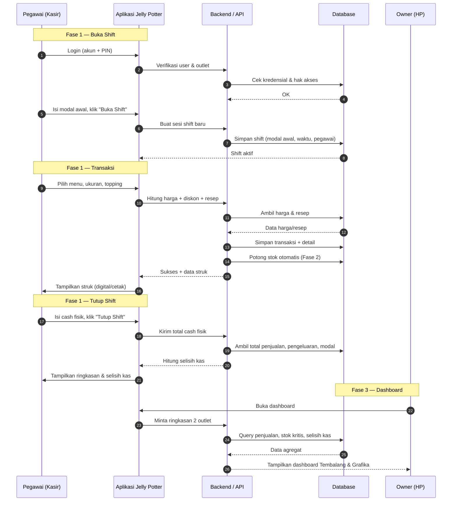
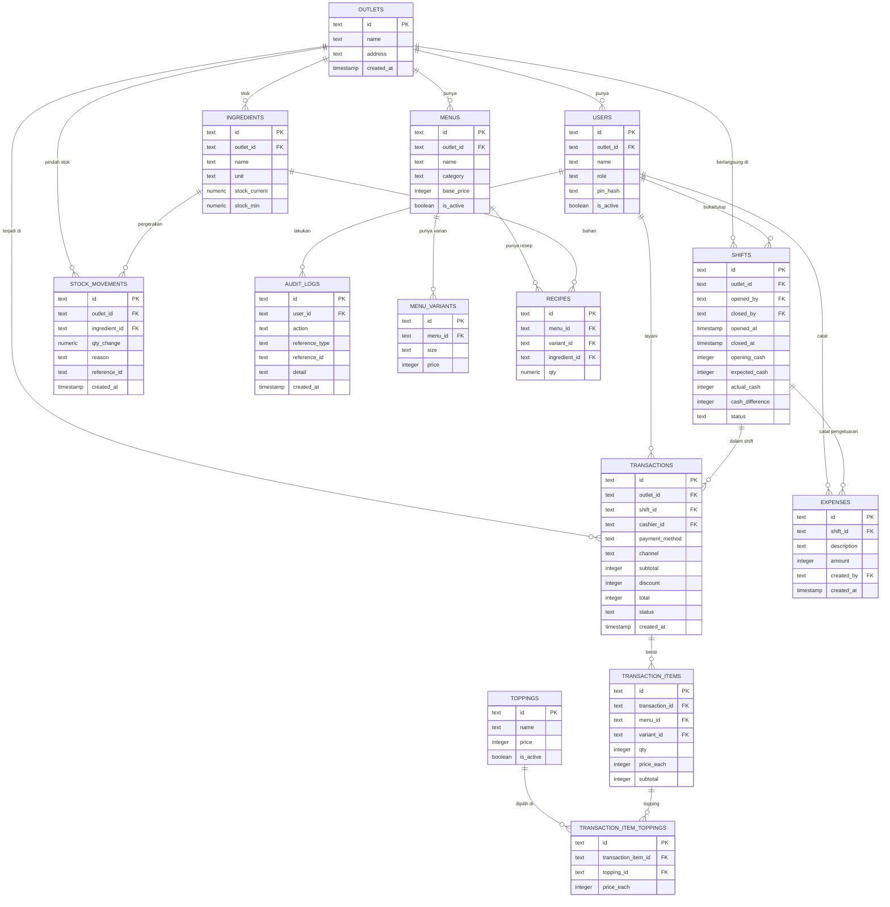

# PRD — Project Requirements Document

## 1. Overview

**Jelly Potter Smart Cashier** adalah aplikasi kasir pintar untuk outlet minuman Jelly Potter yang bukan sekadar mesin hitung uang, tetapi **alat kontrol penjualan, stok, pegawai, dan uang outlet** dalam satu sistem.

**Masalah yang diselesaikan:**
- Selama ini pencatatan penjualan, stok bahan, dan uang kas dilakukan manual, sehingga sering tidak sinkron (contoh: kejual 5 Oreo Jus, tapi stok cup/bahan tidak ikut berkurang dan uang masuk–keluar tidak jelas).
- Owner sulit mengetahui selisih kas tiap shift tanpa menghitung ulang secara manual.
- Owner tidak bisa memantau dua outlet (Tembalang & Grafika) sekaligus dalam satu layar.
- Sulit melacak transaksi, void, refund, dan diskon dilakukan oleh pegawai yang mana (Eka, Elsya, Mia, Pasya).

**Tujuan utama:**
- Sekali transaksi, semua otomatis tercatat: penjualan, stok bahan, pembayaran, dan kinerja shift.
- Owner bisa langsung tahu **"seharusnya Rp1.250.000, fisik Rp1.225.000 → selisih -Rp25.000"** tanpa hitung manual.
- Setiap shift wajib dibuka dengan modal awal dan ditutup dengan hitungan kas.
- Satu dashboard untuk memantau Tembalang + Grafika dari HP.

**Kemenangan pertama (first win) pengguna:** Pegawai berhasil **buka shift & isi modal awal** dengan lancar di awal hari kerja.

**Konsep akhir:** *"Jelly Potter Smart Cashier — bukan hanya mencatat transaksi, tetapi membantu owner mengetahui ke mana uang, stok, dan penjualan bergerak setiap hari."*

---

## 2. Requirements

**Kebutuhan fungsional utama:**
- Aplikasi harus bisa dipakai pegawai untuk melayani transaksi dari layar kasir (pilih menu, ukuran, topping, dan bayar).
- Harga, diskon, dan promo harus terhitung **otomatis** — tidak boleh diubah manual tanpa PIN owner/manager.
- Setiap shift **wajib** dibuka (isi modal awal) dan ditutup (isi kas fisik) — tidak ada transaksi tanpa shift aktif.
- Mendukung pembayaran tunai, QRIS, debit, dan pembayaran digital lain.
- Setiap penjualan otomatis mengurangi stok bahan & kemasan sesuai resep standar.
- Sistem menghitung **cash seharusnya**, lalu membandingkan dengan **cash fisik** untuk memunculkan **selisih kas** per shift.
- Dashboard menampilkan penjualan Tembalang & Grafika secara terpisah dan berdampingan.
- Setiap transaksi, void, refund, dan diskon tercatat atas nama pegawai yang login.
- Pesanan dari kanal online (GoFood, GrabFood, ShopeeFood) dan kasir offline masuk ke **satu sistem yang sama**, supaya owner tidak perlu membuka banyak laporan untuk mengetahui omzet sebenarnya.

**Kebutuhan non-fungsional:**
- Mudah dipakai pegawai baru tanpa pelatihan panjang (UI sederhana, tombol besar, teks jelas).
- Cepat dan stabil saat jam sibuk (banyak transaksi beruntun).
- Aman: setiap aksi sensitif (ubah harga, void, refund) butuh PIN/akun berwenang.
- Owner bisa memantau dari HP kapan saja.
- Data dua outlet tidak boleh tercampur.

**Prioritas (sesuai roadmap):**
- Fase 1: Kasir & Transaksi + Buka/Tutup Shift (high)
- Fase 2: Stok Otomatis + Resep Standar (high/medium)
- Fase 3: Dashboard 2 Outlet + Kontrol Pegawai (high/medium)
- Fase 4: Pengaturan & Akun (low)

**Prioritas Fitur (Level):**
- **Level 1 — WAJIB:** Kasir + QRIS + laporan shift + kontrol kas + akun pegawai.
- **Level 2 — PENTING:** Stok bahan + resep standar + laporan waste + dashboard owner.
- **Level 3 — SMART:** Integrasi GoFood/GrabFood/ShopeeFood + analisis produk terlaris + prediksi kebutuhan stok + notifikasi otomatis ke HP owner.

---

## 3. Core Features

> Semua fitur di bawah **selaras dengan roadmap yang sudah disetujui** dan disusun per fase.

### Fase 1 — Fondasi Kasir & Uang

**Kasir & Transaksi** [high]
Layar utama untuk melayani pembeli dan mencatat setiap penjualan jadi satu transaksi lengkap.
- **Pilih Menu & Topping** — Pegawai memilih menu, ukuran, dan topping langsung dari layar.
- **Harga & Diskon Otomatis** — Harga, promo, dan diskon terhitung sendiri tanpa dihitung manual.
- **Pilihan Pembayaran** — Mendukung bayar tunai, QRIS, debit, dan pembayaran digital lain.
- **Struk Digital & Cetak** — Pembeli bisa terima struk tercetak atau versi digital.
- **Kunci Harga dengan PIN** — Harga hanya bisa diubah oleh owner atau manager lewat PIN.

**Buka & Tutup Shift** [high]
Setiap shift wajib dibuka dengan modal awal dan ditutup dengan hitungan kas, jadi uang outlet selalu ketahuan.
- **Buka Shift & Modal Awal** — Pegawai memulai shift dengan mengisi jumlah modal awal kas.
- **Catat Pengeluaran Outlet** — Semua uang yang keluar selama shift dicatat di tempat yang sama.
- **Hitung Kas Akhir** — Sistem menghitung uang yang seharusnya ada, lalu dibandingkan dengan uang fisik.
- **Lihat Selisih Kas** — Owner langsung melihat selisih kas tiap shift, misalnya kurang Rp25.000.
- **Tutup Shift & Ringkasan** — Shift ditutup dengan ringkasan singkat penjualan dan kas shift itu.

### Fase 2 — Stok & Resep Otomatis

**Stok Otomatis** [high]
Stok bahan dan kemasan berkurang sendiri setiap ada penjualan, jadi tidak perlu dicatat ulang.
- **Daftar Stok Bahan** — Semua bahan dan kemasan outlet terdaftar dengan jumlahnya.
- **Potong Stok Otomatis** — Setiap penjualan langsung mengurangi stok bahan dan kemasan terkait.
- **Peringatan Stok Kritis** — Sistem memberi tanda saat bahan atau kemasan hampir habis.
- **Cek Stok Fisik vs Sistem** — Pegawai bisa membandingkan jumlah di sistem dengan hitungan fisik.
- **Riwayat Pemakaian Bahan** — Riwayat bahan yang terpakai bisa dilihat kapan saja.

**Resep Standar** [medium]
Tiap menu punya resep baku, sehingga kebutuhan bahan bisa dihitung dari jumlah penjualan.
- **Resep per Menu** — Setiap menu disimpan bersama daftar bahan bakunya.
- **Takaran per Porsi** — Jumlah tiap bahan dicatat, misalnya 10 gram topping coco crunchy per cup.
- **Hitung Kebutuhan Bahan** — Sistem menghitung total bahan yang seharusnya terpakai dari penjualan.
- **Deteksi Waste & Selisih** — Selisih antara kebutuhan resep dan stok fisik membantu mendeteksi waste.

### Fase 3 — Visibilitas Owner

**Dashboard Dua Outlet** [high]
Owner cukup buka HP untuk melihat kondisi Tembalang dan Grafika dalam satu layar.
- **Ringkasan Hari Ini** — Total penjualan hari ini langsung terlihat begitu dashboard dibuka.
- **Penjualan per Outlet** — Penjualan Tembalang dan Grafika ditampilkan terpisah dan berdampingan.
- **Produk Terlaris** — Menu paling laku hari ini ditampilkan otomatis.
- **Stok Kritis & Selisih Kas** — Peringatan stok menipis dan selisih kas muncul di dashboard.
- **Unduh Laporan** — Owner bisa mengunduh laporan penjualan dan kas kapan pun.

**Kontrol Pegawai** [medium]
Tiap pegawai punya akun sendiri, jadi semua transaksi, void, dan selisih kas jelas siapa pelakunya.
- **Akun & PIN Pegawai** — Setiap pegawai punya akun dan PIN sendiri untuk masuk.
- **Transaksi per Pegawai** — Sistem mencatat transaksi dilakukan oleh pegawai yang mana.
- **Riwayat Void, Refund & Diskon** — Pembatalan, pengembalian, dan diskon tercatat atas nama pegawai.
- **Performa & Selisih per Pegawai** — Owner bisa melihat kinerja dan selisih kas tiap pegawai, seperti Eka atau Elsya.

**Laporan Harian ke HP Owner** [high]
Owner cukup buka HP untuk menerima ringkasan harian otomatis, tanpa perlu membuka banyak laporan terpisah.
- **Ringkasan Harian Otomatis** — Owner menerima rekap harian siap baca langsung di HP.
- **Format Singkat** — Ringkasan disusun ringkas, misalnya:

```
JELLY POTTER
🧋 Tembalang : Rp xxx
🧋 Grafika   : Rp xxx
📈 Total hari ini  : Rp xxx
🏆 Produk terlaris : xxx
📦 Stok kritis     : xxx
💰 Selisih kas     : xxx
```
- **Pantau Terpisah / Gabungan** — Owner bisa melihat angka tiap outlet **terpisah** maupun **digabung**.
- **Notifikasi Otomatis** — Ringkasan dikirim otomatis ke HP owner (mis. tiap tutup shift atau akhir hari).

### Fase 4 — Pengaturan Dasar

**Pengaturan & Akun** [low]
Pengaturan dasar aplikasi: pengguna, outlet, harga, dan format struk.
- **Login Owner & Manager** — Owner dan manager masuk dengan akun masing-masing sesuai hak aksesnya.
- **Kelola Outlet** — Owner bisa menambah dan mengatur data tiap outlet.
- **Hak Ubah Harga** — Pengaturan siapa saja yang boleh mengubah harga menu.
- **Atur Struk & Identitas Toko** — Nama toko, alamat, dan tampilan struk bisa diubah sesuai kebutuhan.

### Fase 5 — Pesanan Online (SMART)

**Pesanan Online Terintegrasi** [medium]
Pesanan dari GoFood, GrabFood, ShopeeFood, dan kasir offline masuk ke satu sistem, supaya omzet yang dilihat owner adalah omzet yang sebenarnya.
- **Satu Kanal Data** — Semua pesanan (online & offline) tercatat di sistem yang sama, bukan laporan terpisah-pisah.
- **Input Manual per Kanal** — Pesanan online **dicatat manual oleh pegawai** di kasir (tanpa integrasi API ke platform), lalu dipilih sumbernya: kasir offline, GoFood, GrabFood, atau ShopeeFood.
- **Rekap Omzet Gabungan** — Owner melihat omzet total dari semua kanal sekaligus, dan tetap bisa dipecah per kanal.
- **Analisis Produk Terlaris** — Produk paling laku dianalisis lintas kanal (online + offline).
- **Prediksi Kebutuhan Stok** — Sistem memperkirakan kebutuhan stok dari pola penjualan.
- **Notifikasi Otomatis ke HP Owner** — Peringatan penting (stok kritis, selisih kas, lonjakan penjualan) dikirim otomatis ke HP owner.

**Catatan:** sesuai keputusan, pesanan online **tidak diintegrasikan lewat API** ke GoFood/GrabFood/ShopeeFood. Semua pesanan online **dimasukkan manual** oleh pegawai dan ditandai kanalnya, sehingga omzet tetap terkumpul dalam satu sistem. Jika suatu saat ingin integrasi otomatis, itu bisa jadi fase terpisah.

---

## 4. User Flow

**Alur 1 — Buka Shift (Kemenangan Pertama)**
1. Pegawai login dengan akun & PIN pribadi.
2. Pilih outlet tempat dia bertugas (Tembalang atau Grafika).
3. Tekan **"Buka Shift"** dan isi jumlah **modal awal kas**.
4. Sistem membuat sesi shift baru, siap menerima transaksi.

**Alur 2 — Melayani Pembeli (Kasir & Transaksi)**
1. Pegawai pilih menu (mis. Choco Lava), lalu pilih ukuran & topping.
2. Harga, promo, dan diskon terhitung otomatis.
3. Pegawai pilih metode bayar (tunai/QRIS/debit/digital).
4. Sistem menyimpan transaksi, memotong stok otomatis, dan menampilkan/mencetak struk.
5. Jika ada void/refund/diskon khusus, wajib PIN owner/manager → tercatat atas nama pegawai.

**Alur 3 — Buka & Tutup Shift (Kontrol Uang)**
1. Sepanjang shift, setiap pengeluaran outlet dicatat di aplikasi.
2. Saat tutup shift, pegawai memasukkan **cash fisik** yang ada di kasir.
3. Sistem otomatis menghitung **cash seharusnya** (modal awal + penjualan tunai − pengeluaran).
4. Sistem menampilkan **selisih kas** (contoh: seharusnya Rp1.250.000 − fisik Rp1.225.000 = −Rp25.000).
5. Pegawai menutup shift, ringkasan tersimpan.

**Alur 4 — Cek Stok & Waste**
1. Setiap penjualan otomatis mengurangi stok cup, tutup, sealer, sedotan, jelly, dan topping sesuai resep.
2. Saat stok menipis, muncul **peringatan stok kritis**.
3. Pegawai bisa cek **stok fisik vs stok sistem**; selisih besar → indikasi waste.

**Alur 5 — Owner Pantau dari HP**
1. Owner login, membuka dashboard.
2. Lihat ringkasan hari ini, penjualan Tembalang & Grafika berdampingan, produk terlaris, stok kritis, dan selisih kas.
3. Owner bisa unduh laporan atau cek performa per pegawai (Eka, Elsya, Mia, Pasya).

**Alur 6 — Pesanan Online Masuk ke Sistem**
1. Pesanan datang dari GoFood, GrabFood, atau ShopeeFood (atau kasir offline).
2. Sistem mencatat pesanan dengan **tanda sumber kanal**-nya.
3. Penjualan otomatis masuk ke rekap omzet yang sama dengan transaksi kasir.
4. Owner melihat omzet total — bisa dipecah per kanal maupun digabung.

**Alur 7 — Owner Terima Laporan Harian di HP**
1. Menjelang tutup hari (atau tiap tutup shift), sistem menyusun ringkasan harian.
2. Ringkasan dikirim otomatis ke HP owner (penjualan per outlet, total hari ini, produk terlaris, stok kritis, selisih kas).
3. Owner membuka HP dan langsung tahu kondisi hari itu tanpa membuka banyak laporan.

---

## 5. Architecture

Aplikasi ini berbentuk **web app (responsif)** yang bisa dibuka di tablet/HP kasir dan HP owner. Berikut gambaran sistemnya:

**Komponen utama:**
- **Aplikasi Pegawai (Kasir)** — Tablet/HP di outlet, untuk transaksi, buka/tutup shift, cek stok.
- **Aplikasi Owner** — HP owner, untuk dashboard, laporan, dan pengaturan.
- **Backend / API** — Mengatur logika harga, stok, resep, hitung kas, dan hak akses.
- **Database** — Menyimpan outlet, menu, resep, transaksi, shift, stok, pegawai, dan log.
- **Printer Struk** — Terhubung ke perangkat kasir untuk cetak struk (opsional).
- **Pencatatan Kanal Online (Manual)** — Pegawai mencatat pesanan GoFood, GrabFood, dan ShopeeFood secara manual ke sistem yang sama, ditandai kanalnya, sehingga omzet online & offline terlihat utuh (lihat Fase 5).
- **Notifikasi Owner** — Mengirim ringkasan harian dan peringatan penting ke HP owner secara otomatis.
- **Penyimpanan Struk Digital** — Link struk digital yang bisa dikirim ke pembeli.

**Diagram arsitektur (sequence):**



---

## 6. Database Schema

Berikut tabel utama yang dibutuhkan. Struktur dirancang agar mendukung 2 outlet, banyak pegawai, resep per menu, dan log audit.

**1. `outlets`** — Data tiap outlet (Tembalang, Grafika).
- `id` (text/uuid) — ID unik outlet.
- `name` (text) — Nama outlet.
- `address` (text) — Alamat outlet.
- `created_at` (timestamp) — Waktu dibuat.

**2. `users`** — Akun pegawai, manager, dan owner.
- `id` (text/uuid) — ID unik user.
- `outlet_id` (text, FK → outlets.id) — Outlet tempat user bertugas (boleh null untuk owner).
- `name` (text) — Nama pegawai (mis. Eka, Elsya).
- `role` (text) — Peran: `owner` / `manager` / `kasir`.
- `pin_hash` (text) — PIN terenkripsi untuk login cepat.
- `is_active` (boolean) — Status aktif.

**3. `menus`** — Daftar menu (mis. Choco Lava, Oreo Jus).
- `id` (text/uuid) — ID menu.
- `outlet_id` (text, FK → outlets.id) — Menu milik outlet mana.
- `name` (text) — Nama menu.
- `category` (text) — Kategori (minuman, dll).
- `base_price` (integer) — Harga dasar.
- `is_active` (boolean) — Tersedia atau tidak.

**4. `menu_variants`** — Ukuran & varian harga per menu.
- `id` (text/uuid) — ID varian.
- `menu_id` (text, FK → menus.id) — Menu induk.
- `size` (text) — Ukuran (Regular, Large).
- `price` (integer) — Harga varian.

**5. `toppings`** — Daftar topping (jelly, coco crunchy, dll).
- `id` (text/uuid) — ID topping.
- `name` (text) — Nama topping.
- `price` (integer) — Harga tambahan.
- `is_active` (boolean) — Tersedia atau tidak.

**6. `ingredients`** — Stok bahan & kemasan (cup, tutup, sealer, sedotan, powder, jelly, topping).
- `id` (text/uuid) — ID bahan.
- `outlet_id` (text, FK → outlets.id) — Stok milik outlet mana.
- `name` (text) — Nama bahan.
- `unit` (text) — Satuan (gram, pcs, ml).
- `stock_current` (numeric) — Jumlah stok saat ini di sistem.
- `stock_min` (numeric) — Batas minimum untuk peringatan stok kritis.

**7. `recipes`** — Resep/BOM per menu atau varian.
- `id` (text/uuid) — ID baris resep.
- `menu_id` (text, FK → menus.id) — Menu terkait.
- `variant_id` (text, FK → menu_variants.id, nullable) — Varian spesifik jika ada.
- `ingredient_id` (text, FK → ingredients.id) — Bahan yang digunakan.
- `qty` (numeric) — Takaran per porsi (mis. 10 gram).

**8. `shifts`** — Sesi kerja pegawai (buka/tutup shift + hitung kas).
- `id` (text/uuid) — ID shift.
- `outlet_id` (text, FK → outlets.id) — Outlet shift.
- `opened_by` (text, FK → users.id) — Pegawai yang membuka.
- `closed_by` (text, FK → users.id, nullable) — Pegawai yang menutup.
- `opened_at` (timestamp) — Waktu buka.
- `closed_at` (timestamp, nullable) — Waktu tutup.
- `opening_cash` (integer) — Modal awal.
- `expected_cash` (integer, nullable) — Cash seharusnya.
- `actual_cash` (integer, nullable) — Cash fisik.
- `cash_difference` (integer, nullable) — Selisih kas.
- `status` (text) — `open` / `closed`.

**9. `expenses`** — Pengeluaran outlet selama shift.
- `id` (text/uuid) — ID pengeluaran.
- `shift_id` (text, FK → shifts.id) — Shift terkait.
- `description` (text) — Keterangan pengeluaran.
- `amount` (integer) — Jumlah uang keluar.
- `created_by` (text, FK → users.id) — Dicatat oleh siapa.
- `created_at` (timestamp) — Waktu dicatat.

**10. `transactions`** — Satu baris untuk setiap transaksi penjualan.
- `id` (text/uuid) — ID transaksi.
- `outlet_id` (text, FK → outlets.id) — Outlet transaksi.
- `shift_id` (text, FK → shifts.id) — Shift terkait.
- `cashier_id` (text, FK → users.id) — Pegawai yang melayani.
- `payment_method` (text) — `cash` / `qris` / `debit` / `digital`.
- `channel` (text) — Sumber pesanan: `offline` / `gofood` / `grabfood` / `shopeefood`.
- `subtotal` (integer) — Total sebelum diskon.
- `discount` (integer) — Total diskon.
- `total` (integer) — Total akhir.
- `status` (text) — `paid` / `void` / `refunded`.
- `created_at` (timestamp) — Waktu transaksi.

**11. `transaction_items`** — Detail item per transaksi.
- `id` (text/uuid) — ID detail.
- `transaction_id` (text, FK → transactions.id) — Transaksi induk.
- `menu_id` (text, FK → menus.id) — Menu yang dibeli.
- `variant_id` (text, FK → menu_variants.id) — Varian/ukuran.
- `qty` (integer) — Jumlah item.
- `price_each` (integer) — Harga satuan.
- `subtotal` (integer) — Subtotal item.

**12. `transaction_item_toppings`** — Topping yang dipilih pada tiap item.
- `id` (text/uuid) — ID baris.
- `transaction_item_id` (text, FK → transaction_items.id) — Item induk.
- `topping_id` (text, FK → toppings.id) — Topping dipilih.
- `price_each` (integer) — Harga topping.

**13. `stock_movements`** — Riwayat pergerakan stok (pemakaian, penambahan, koreksi).
- `id` (text/uuid) — ID baris.
- `outlet_id` (text, FK → outlets.id) — Outlet.
- `ingredient_id` (text, FK → ingredients.id) — Bahan.
- `qty_change` (numeric) — Perubahan (negatif jika terpakai).
- `reason` (text) — `sale` / `restock` / `adjustment` / `waste`.
- `reference_id` (text, nullable) — Referensi transaksi/shift.
- `created_at` (timestamp) — Waktu perubahan.

**14. `audit_logs`** — Log aksi sensitif (void, refund, ubah harga, ubah diskon).
- `id` (text/uuid) — ID log.
- `user_id` (text, FK → users.id) — Pelaku.
- `action` (text) — Jenis aksi.
- `reference_type` (text) — Jenis referensi (transaction, menu, dll).
- `reference_id` (text) — ID referensi.
- `detail` (text, nullable) — Detail tambahan.
- `created_at` (timestamp) — Waktu kejadian.

**Diagram ER:**



---

## 7. Tech Stack

Stack dipilih: **Laravel + Filament + MySQL**, dengan prinsip utama **"kasir harus cepat dan mudah dipakai"**. Untuk itu panel admin dan layar kasir dipisah, bukan disatukan:

**Backend & Framework**
- **Laravel 11 (PHP)** — Kerangka utama aplikasi. Cocok untuk logika harga, resep, hitung kas, dan relasi data yang dijelaskan di §6.
- **Laravel Auth + PIN** — Login pegawai/owner, ditambah kolom `pin_hash` untuk aksi sensitif (ubah harga, void, refund).
- **Spatie Permission** — Mengatur hak akses `owner` / `manager` / `kasir` per outlet.

**Panel Admin (Owner & Manager)**
- **Filament** — Dipakai untuk semua layar back-office: kelola outlet, menu, varian, topping, resep, stok bahan, pegawai, laporan, dan audit.
- **Filament Resource** — Menu utama di panel owner (mis. grup "Menu & Produk" untuk menu/varian/topping, grup "Stok" untuk bahan & resep) dibangun sebagai Resource, jadi CRUD + filter + export laporan tinggal dirakit.
- **Notifikasi & Dashboard Owner** — Widget Filament untuk ringkasan harian, penjualan per outlet (terpisah/gabungan), produk terlaris, stok kritis, dan selisih kas.

**Layar Kasir (POS)**
- **Livewire + Blade + Alpine.js** — Layar kasir dibuat **custom**, **bukan** memakai Filament. Alasannya: saat jam sibuk kasir butuh tombol besar, grid menu cepat, dan alur sentuh beruntun — hal yang lebih pas dibuat khusus daripada memakai panel admin.
- **Tailwind CSS** — Styling tombol besar dan tata letak yang jelas, ramah tablet/HP.
- Prinsip UI kasir: **minim klik** (pilih menu → ukuran/topping → bayar → struk), angka besar, dan konfirmasi jelas untuk aksi sensitif (PIN).

**Database**
- **MySQL** — Database utama sesuai permintaan. Skema di §6 (outlet, menu, resep, transaksi, shift, stok, pegawai, log) dipetakan lewat **Laravel Migration + Eloquent**.
- Struktur tetap DB-agnostic, jadi masih bisa dipindah ke PostgreSQL bila suatu saat perlu.

**Pesanan Online (GoFood / GrabFood / ShopeeFood)**
- **Manual (pencatatan pegawai)** — Pesanan online **tidak** diintegrasikan lewat API ke masing-masing platform. Pegawai mencatat pesanannya di kasir, lalu memilih `channel` (`gofood` / `grabfood` / `shopeefood` / `offline`).
- Semua kanal tetap masuk ke **satu rekap omzet** yang sama, dan bisa dipecah per kanal.

**Deployment & Perangkat**
- **VPS / Laravel Forge** (atau shared hosting ber-PHP) + MySQL — Server harus bisa menjalankan PHP.
- **Backup database harian** agar data penjualan & kas aman.
- **Printer struk thermal** (opsional) di outlet; **HP/tablet** sebagai perangkat kasir & HP owner.

**Alasan pemilihan:**
- Laravel + Filament mempercepat bagian yang paling banyak repetisi (CRUD menu, stok, pegawai, laporan) — owner/manager dapat panel admin rapi tanpa membangun dari nol.
- Layar kasir dipisah custom supaya **kasir tetap cepat dan tidak tersesat di menu admin**.
- MySQL sebagai database matang untuk transaksi multi-outlet.
- Pesanan online dicatat manual agar implementasi ringan dan tidak bergantung pada kerja sama API platform, namun omzet tetap utuh dalam satu sistem.